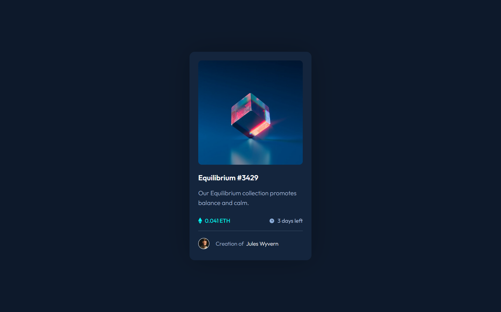

# My second project and solution to the nft preview card component challenge over at [Frontend Mentor](https://www.frontendmentor.io/challenges)

## This was the assignment

## This is my solution

[Click here to see the live page](https://arthurpog.github.io/nft-preview-card-component/)

One of the biggest problems that I had was centering the SVGs vertically with the text that was next to them. Still don't know how it's done. I checked many tutorials and read documentations on W3C and, quite frankly, my head hurts. I'm sure Ill come back to this.
